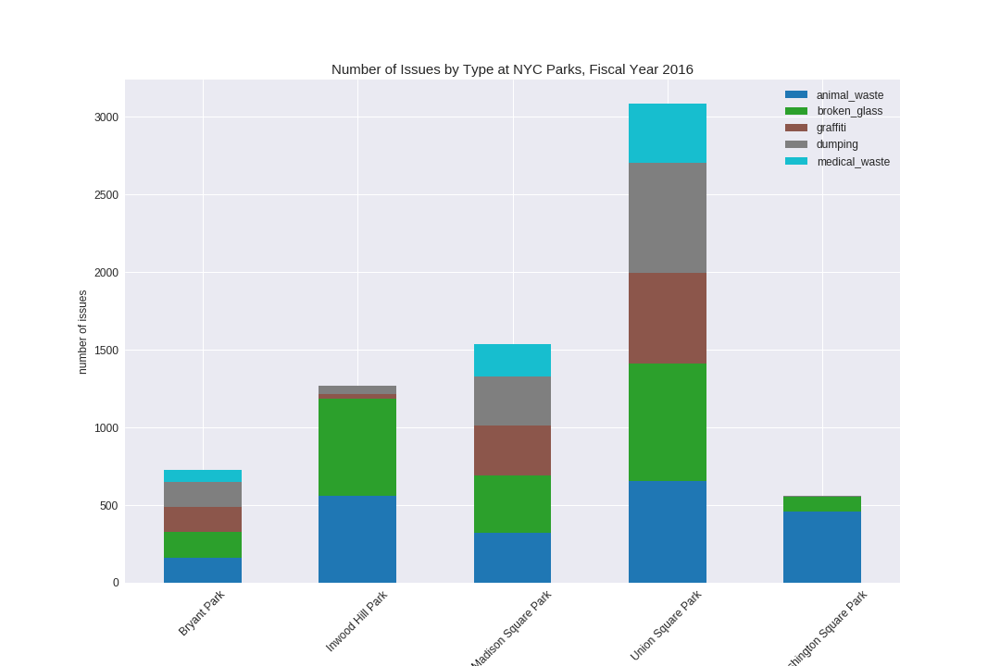

# Make a Plot

Below is a plot of the number of issues that NYC Parks Crews cleaned/responding to in 5 different parks in Manhattan during the 2016 Fiscal Year.

Data source: [NYC Open Data: NYC Parks Daily Tasks Cleaning Records Fiscal Year 2016](https://data.cityofnewyork.us/Environment/NYC-Parks-Daily-Tasks-Cleaning-Records-Fiscal-Year/kwte-dppd)

